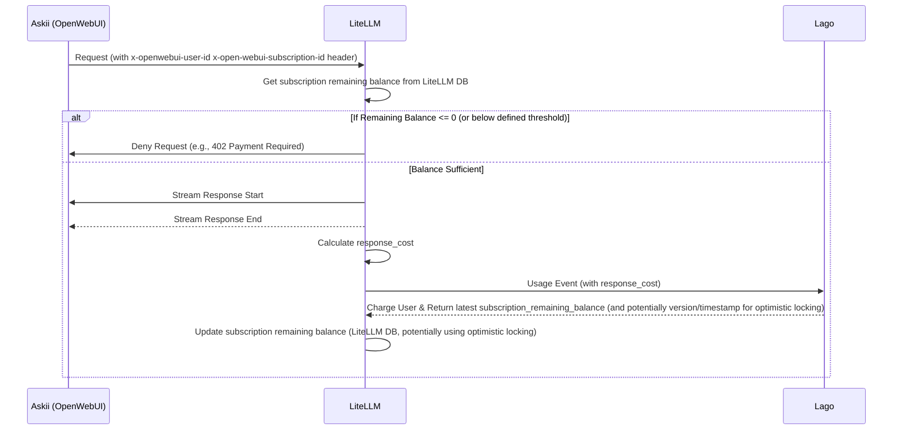

## Billing Process
> Author: [Tran Thien](thientran@coderpush.com).  
> Status: `Proposed`.  
> Target Review due date: May 8, 2024.    
> Target Approval date: May 8, 2024.  
> Reviewers: abc.  
> Approver: Dale Le 

# Problem Statement & Epic Overview
Askii.ai is an AI project that focus on providing AI service. There is some problem that we have to deal with:

- **Metric-base subscription**: Askii cost of query is vary and very small (about 0.0001$ - 0.003$). If we map each query with a incremental subscription charge, we have to create/send many incremental charge through the network. Because it is also very small, so the Moneta network fee is high (lower the transaction amount will have higher percentage exchange rate). Further more, process many small transactions through the network not only flood the MO/Publisher but also increase operation cost for all participants (network, storage, computation).

- **Entitlement**: Streaming response and response cost only available when ending. When user create a query. the Askii.ai will stream the result as many chunks. Each chunk will have it own tokens/response cost. So we wont know about the final response cost until the streaming response finished. It raises a challenge to entitlement for a query. If we have to wait until the end of the response then performing entitlement check, the user experience will be seriously impacted. On the other side, we may lose the money if user balance is not sufficient or subscription charge failures.

- **Budget Tracking**: Display user remaining budget realtime. Calculate remaining budget require to aggregate on all plan's billable metrics. This is an expensive operation. In the other hand, this function will be called very often to show realtime remaining balance and by many view/pages.

- **Multi-subscription support (Future)**: User can switch between subscription because of a surge of usage. For now, Lago+ with entitlement API which bases on AWS AVP will auto choose a matched subscription instead of letting users choose it.

- **Free Trial**: 
    - **Challenge**: How to implement and manage free trial access?
    - **Considerations**: 
        - Will this be a separate plan in Lago?
        - How will usage be tracked and limited during the free trial?
        - What is the user experience transitioning from a free trial to a paid plan?
        - How does entitlement work for free trial users (e.g., can they access all features, or a limited set)?

# High-level architecture diagram

1. **Askii (OpenWebUI)**: The frontend application that sends LLM API requests to LiteLLM
2. **LiteLLM**: The middleware that processes LLM requests, performs entitlement checks and send usage event to Lago.
3. **Lago**: The billing system that tracks usage and manages payments




# Key design decision & consideration

## Follow Async approach
The nature of an AI chat service is realtime response. Therefore, we need to enabling user to receive realtime answers. Follow async approach, the system will enable user to see the result before the charging process start. While the async approach introduces a small risk of revenue loss if billing fails post-usage, this is deemed acceptable given the typically small transaction values, prioritizing user experience. Mechanisms will be in place to minimize such losses.

**Consideration 1: Balance threshold** We can put a threshold (like 0.001$) that check if user remaining balance is above the threshold. When user remaining balance under threshold, (like 0.0005), we will not allow them to use the service.

Pros: 
- We can reduce the loss because we can guarantee user usually have enough balance to perform the next query.

Cons:
- **Complicated Interaction with Lago's Billing Logic**: By default, Lago may not trigger a charge (and subsequent processes like auto-renewal) if the aggregated billable metric usage, reported via events, does not surpass a defined limit or package amount. If LiteLLM's local threshold check strictly prevents users from making requests that would push their usage *just over* such a limit, Lago might never see the "triggering" event.
    - **Impact on Auto-Renewal**: This could prevent auto-renewal from occurring as expected, as Lago might not consider the current billing period "closed" or the package "consumed."
    - **Potential Mitigation/Investigation**:
        - Does Lago offer a way to "ping" a subscription or send a zero-amount event to trigger its internal logic if needed?
        - Can LiteLLM periodically send aggregated usage to Lago, even if it's below the user-facing threshold, to ensure Lago's state is updated?
        - Explore if Lago's `grace_period` settings for subscriptions can be leveraged.
        - This interaction needs careful testing and potentially consultation with Lago support or documentation.

## Use Lago billable metric as a frontier layer to reduce incremental charges.

> TODO: Need to align with anh Trung concept.

We will create a monetary billable metrics (e.g., `credit_cents`) that represent for total cost that a user spends on a subscription. In LiteLLM, after finishing a request, we will calculate the `response_cost` of query and send an usage event to the metric above with the `subscription_id`.

**[Plan: Starter (0.5$)](https://thepressingly.atlassian.net/wiki/spaces/AAS/pages/7471120/Askii.ai+MVP+Pricing+Plans)**  
Allow users to prepay a set amount for usage, which they can draw down from

Expiration: None - valid until fully consumed
Key Features:
- User pays upfront upon first query
- No time limit - budget remains valid until fully used
- Real-time "remaining balance" display
- Auto-renewal option available but not default on
- Ideal for occasional users who want full control

Setup: (proposal)
- Plan Interval: UndefinedPeriod
- BillingFinalizationUpfront: True
- Metric Charges
  - `credit_cents`
    - Charge Model: Package
    - Pay in Advance 
    - Amount: $0.50 Per 50 Credits (e.g., 50 units of `credit_cents` if 1 unit = 1 cent)

**Billable Metric Example**
- Name: `credit_cents`
- Aggregation Type: `sum`
- Property to aggregate: `credit_cents` (e.g., value could be `0.5` for half a cent)

```bash
# Example event: reporting a cost of $0.0023 (0.23 cents)
curl --location --request POST "https://gpt-portal-lagoapi.sandbox.pressingly.net/api/v1/events" \
  --header "Authorization: Bearer __YOUR_API_KEY__" \
  --header 'Content-Type: application/json' \
  --data-raw '{
    "event": {
      "transaction_id": "__UNIQUE_ID__", // e.g., LiteLLM request ID
      "external_subscription_id": "__EXTERNAL_SUBSCRIPTION_ID__", // The subscription ID from OpenWebUI/our system
      "code": "credit_cents", // The billable metric code in Lago
      "timestamp": "__UNIX_TIMESTAMP__", // Optional: recommended for event ordering
      "properties": {
          "credit_cents": 0.23, // The cost in cents
      }
    }
}'
```

## Askii needs to send the selected subscription_id to LiteLLM.
As a part of subscription management, Askii will able to list all user subscriptions on the UI and allow user to choose which subscription will be used.

With chat feature, when user submit a query, Askii need to include the current chosing subscription id to Litellm through request header (e.g., `X-OpenWebUI-Subscription-Id`).

With the Pipe/Filter/Action function (and other non-interactive API calls), when we call API, we also need to send the current subscription too. The challenge of sending subscription is it's hard to get current_subscription_id and send through many functions without modifying interfaces.

To solve the issue above, Everytime user change subscription, The system will update `user.settings.default_subscription_id` into the selected subscription. So, when LiteLLM is called for these background processes, we can extract the `subscription_id` from `user.settings` instead of transmitting `current_subscription_id` through interfaces.

In the `backend/open_webui/routes/openai.py`, we add `current_subscription_id` as a HTTP request header (`X-OpenWebUI-Subscription-Id`) to all the OpenAI/OpenAI-Like requests.

## Use subscription remaining balance as an entitlement check instead of using entitlement endpoint

Lago+ extension provide an entitlement API which support us to ask if user can access a resource or not. This API also include usage event as request body so Lago can update billable metrics if any. In the first place, we design this endpoint as a synchronuous API so publisher can integrate with it easily.

When we move to async approach, we are not able to follow this approach because submit usage event is now an async step. It can not prevent user from consume resource anymore. To optimize for async approach, we will use subscription remaining balance which check the remaining balance of subscription (cached in LiteLLM DB). This comparison is easy to use and the data is cache-able. 

## Use LiteLLM DB to cache subscription remaining balance.

In async process (`CustomLogger.async_log_success_event`), after submitting the usage event, LiteLLM receives the updated `subscription_remaining_balance` from Lago. We will store this `subscription_remaining_balance` to LiteLLM DB to do entitlement check for the next query.

**Challenge: Stale Cache and Concurrent Updates**
When multiple queries run in parallel for the same subscription, the cached balance can be overwritten by an older value if updates are not handled atomically or with a concurrency control mechanism.

**Solution: Optimistic Locking**
We can apply optimistic locking to update the balance only if the underlying data hasn't changed since it was last read.
**Table design: `lago_subscriptions`**

- `id`: `uuid` (Primary Key) - Internal LiteLLM DB identifier for this cached record.
- `subscription_id`: `string` - Required. The unique subscription ID from Lago. This is the `external_subscription_id` used in Lago event API calls if it's the ID from OpenWebUI/your system that Lago knows.
- `customer_id`: `string` - Required. Lago external customer id, which should map to OpenWebUI user ID.
- `plan_code`: `string` - Optional. The code of the plan in Lago (e.g., `starter_plan_v1`). Useful for context.
- `status`: `string` - `active` (default) or `suspended`. This status will be calculated by LiteLLM based on `remaining_balance` and `balance_threshold`.
- `remaining_balances`: `jsonb` - Current remaining balances for various metrics of a subscription, as reported by Lago.
    - **Example data**: `{ "credit_cents": 123.50, "data_transfer_gb": 5.5}`
- `remaining_balance_snapshot_at`: `timestamp` - use as optimistic locking key
- `created_at`: `timestamp`
- `updated_at`: `timestamp`

# Non-functional requirements

- **Performance:**
    - Entitlement check latency (LiteLLM DB query): < 20ms (P95).
    - Async usage event submission to Lago: Should not block the user response path. Completion time < 500ms (P95).
- **Reliability & Durability:**
    - Usage Events: Guaranteed delivery to Lago. Implement a robust retry mechanism with exponential backoff and dead-letter queue for events that fail repeatedly.
    - LiteLLM DB: High availability and data durability for cached balances.
- **Accuracy & Consistency:**
    - Billing Accuracy: `response_cost` calculation must be precise. `credit_cents` (or chosen unit) conversion must be accurate.
- **Scalability:**
    - System should handle X concurrent users and Y requests per second (Define X and Y based on expected load).
    - Lago event ingestion: Ensure it can handle the peak volume of usage events.
    - Lago DB engine should be `ClickDB` instead of `PostgreSQL` for faster data aggregation.
- **Stop Loss:**
    ...
- **Security:**
    - Prevent users to abuse trial plans by re-subscribing.

# APIs and integrations

## Askii (OpenWebUI)
From Askii (OpenWeb UI), We need to build a new subscription management and update the LiteLLM integration to send more data.


### Subscription Management & Selection
- **Displaying Available Subscriptions**:
    - Askii UI will query and display all of the user's active subscriptions.
    - **Data Source**: This list of subscriptions will be fetched from Lago. This will be an indirect query. Askii frontend will request this list from an Askii backend service, which in turn queries Lago. This is to avoid exposing Lago API keys to the client and to handle potential CORS issues.
- **Setting the Active Subscription**:
    - When a user selects a subscription from the displayed list in the Askii UI, or if a subscription is chosen by any other means (e.g., initial subscription activation), the Askii backend will update the `user.settings.default_subscription_id` field for that user to this chosen subscription's ID.
    - `user.settings.default_subscription_id` becomes the **single source of truth** for the currently active/selected subscription for all operations, including interactive chat and background processes.

### Sending Subscription ID to LiteLLM
- **Unified Approach**: For all requests to LiteLLM (interactive chat, background processes, etc.) that require a subscription context:
    - The component making the request (e.g., Askii backend for chat, or a background service) will first retrieve the `user.settings.default_subscription_id` for the relevant user.
    - This retrieved `default_subscription_id` will then be passed to LiteLLM via the `X-OpenWebUI-Subscription-Id` HTTP header.
    - This ensures LiteLLM consistently uses the subscription that the user has designated as their current default.
- **Example**: In `backend/open_webui/routes/openai.py`, before forwarding a request to LiteLLM, the Askii backend will:
    1. Identify the user (e.g., via `x-openwebui-user-id`).
    2. Fetch `user.settings.default_subscription_id` for this user.
    3. Add this ID as the `X-OpenWebUI-Subscription-Id` header.

## LiteLLM
Use LiteLLM CustomLogger (`async_log_success_event`) to:
1.  Perform initial entitlement check (using cached balance from LiteLLM DB).
2.  After successful LLM response:  
    a. Calculate `response_cost`.  
    b. Construct and send usage event to Lago.  
    c. Receive updated balance information from Lago.  
    d. Update the cached `lago_subscriptions` record in LiteLLM DB (using optimistic locking). 

# Test Strategy outline

- **Unit Tests:**
    - `response_cost` calculation logic in LiteLLM.
    - Entitlement check logic in LiteLLM (based on cached balance and thresholds).
    - Lago event formatting.
    - Optimistic locking conflict resolution logic in LiteLLM.
- **Integration Tests:**
    - Full flow: Askii (mocked) -> LiteLLM -> Lago (mocked/sandbox).
        - Test successful request, usage event, balance update.
        - Test request denial due to insufficient balance.
    - LiteLLM <-> LiteLLM DB: Correct caching and retrieval of balance.
    - LiteLLM <-> Lago API:
        - Event submission and response handling (success, failures, retries).
        - Handling of various Lago API responses (e.g., errors, different balance structures).
- **End-to-End Tests (with actual Lago sandbox):**
    - User signs up, gets a subscription.
    - User makes requests, usage is tracked, balance is updated.
    - Test threshold logic: user balance drops below threshold, access is denied/restricted.
    - Test auto-renewal (if applicable to plan and threshold logic correctly interacts).
    - Test plan changes/upgrades/cancellations if part of MVP.
- **Performance Tests:**
    - Load testing on LiteLLM entitlement check endpoint.
    - Measuring latency of the async event submission process.
- **Failure Scenario Testing:**
    - Lago API unavailable: Test retry mechanisms.
    - LiteLLM DB unavailable: Test fallback behavior (e.g., deny access if cache is critical).
    - Invalid data from Lago.
    - Race conditions for balance updates (if optimistic locking is not perfectly implemented).
- **Billing Accuracy Tests:**
    - Generate known amounts of usage, verify that the `credit_cents` (or other units) sent to Lago are correct.
    - Reconcile Lago invoices/reports with internal usage logs.
- **Security Tests:**
    - Ensure API keys are not exposed.
    - Test for any vulnerabilities in how subscription data is handled.

# Open Questions & Risks

- **Risks:**
    - **Data Inconsistency**: Cached balance in LiteLLM DB might become stale or inconsistent with Lago's actual balance, leading to incorrect entitlement decisions. Requires robust update and reconciliation.
    - **Revenue Loss**:
        - Failures in async event submission to Lago.
        - Bugs in `response_cost` calculation.
        - Users consuming resources when their true balance (in Lago) is depleted but LiteLLM cache is stale.
    - **Race Conditions**: Concurrent updates to the same subscription balance in LiteLLM DB if optimistic locking is not effective.
    - **Complexity**: The interaction between LiteLLM's local threshold and Lago's billing logic for things like package consumption and auto-renewal could be complex to implement correctly.
    - **Scalability of Event Submission**: If many users generate many small events, the async processing queue in LiteLLM needs to be scalable.

# Additional Section

