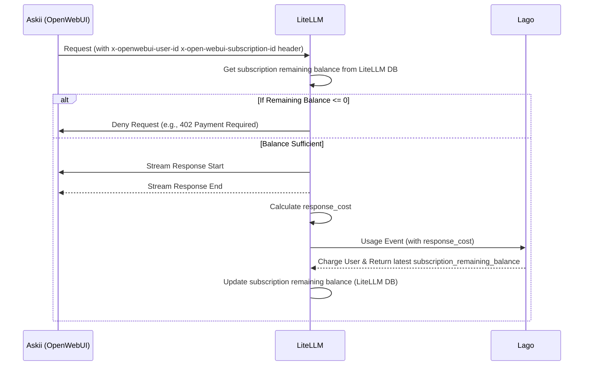

## Billing Process
> Author: [Tran Thien](thientran@coderpush.com).  
> Status: `Proposed`.  
> Target Review due date: May 8, 2024.    
> Target Approval date: May 8, 2024.  
> Reviewers: abc.  
> Approver: Dale Le 

# Problem Statement & Epic Overview
Askii.ai is an AI project that focus on providing AI service. There is some problem that we have to deal with:

- **Metric-base subscription**: Askii cost of query is vary and very small (about 0.0001$ - 0.003$). If we map each query with a incremental subscription charge, we have to create/send many incremental charge through the network. Because it is also very small, so the Moneta network fee is high (lower the transaction amount will have higher percentage exchange rate). Further more, process many small transactions through the network not only flood the MO/Publisher but also increase operation cost for all participants (network, storage, computation).

- **Entitlement**: Streaming response and response cost only available when ending. When user create a query. the Askii.ai will stream the result as many chunks. Each chunk will have it own tokens/response cost. So we wont know about the final response cost until the streaming response finished. It raises a challenge to entitlement for a query. If we have to wait until the end of the response then performing entitlement check, the user experience will be seriously impacted. On the other side, we may lose the money if user balance is not sufficient or subscription charge failures.

- **Budget Tracking**: Display user remaining budget realtime. Calculate remaining budget require to aggregate on all plan's billable metrics. This is an expensive operation. In the other hand, this function will be called very often to show realtime remaining balance and by many view/pages.

- **Multi-subscription support (Future)**: User can switch between subscription because of a surge of usage. For now, Lago+ with entitlement API which bases on AWS AVP will auto choose a matched subscription instead of letting users choose it.

- **Free Trial**: 


# High-level architecture diagram

1. **Askii (OpenWebUI)**: The frontend application that sends LLM API requests to LiteLLM
2. **LiteLLM**: The middleware that processes LLM requests, performs entitlement checks and send usage event to Lago.
3. **Lago**: The billing system that tracks usage and manages payments




# Key design decision & consideration

## Follow Async approach
The nature of an AI chat service is realtime response. Therefore, we need to enabling user to receive realtime answers. Follow async approach, the system will enable user to see the result before the charging process start. It means Askii may not lose money when the billing process is fail. But because the transaction value is small, so we can focus on minimize the loss instead of strictly checking.

**Consideration 1: Balance threshold** We can put a threshold (like 0.001$) that check if user remaining balance is above the threshold. When user remaining balance under threshold, (like 0.0005), we will not allow them to use the service  

Pros: 
- we can reduce the loss because we can guarantee user usually have enough balance to perform the next query.

Cons:
- Complicated Implementation. By default, Lago won't trigger a charge if the billable metric aggregation does not surpass the limit. By putting a threshold, we prevent the event that surpass the limit so the charge will never happen. Because of that, the auto-renewal will not happen

## Use Lago billable metric as a frontier layer to reduce incremental charges.

> TODO: Need to align with anh Trung concept.

We will create a monetary billable metrics (credit_cents) that represent for total cost that a user spends on a subscription. In LiteLLM, after finishing a request, we will calculate the response_cost of query and send an usage event to the metric above with the subscription_id.

**[Plan: Starter (0.5$)](https://thepressingly.atlassian.net/wiki/spaces/AAS/pages/7471120/Askii.ai+MVP+Pricing+Plans)**  
Allow users to prepay a set amount for usage, which they can draw down from

Expiration: None - valid until fully consumed
Key Features:
- User pays upfront upon first query
- No time limit - budget remains valid until fully used
- Real-time "remaining balance" display
- Auto-renewal option available but not default on
- Ideal for occasional users who want full control

Setup: (proposal)
- Plan Interval: UndefinedPeriod
- BillingFinalizationUpfront: True
- Metric Charges
  - credit_cents
    - Charge Model: Package
    - Pay in Advance 
    - Amount: 0.5$ Per 50 Credits (Note: Because Lago only support integer for `per`, so we have to use cent metric instead of dollar metric).
    


**Billable Metric**
- Name: credit_cents
- Aggregation Type: Sum
- Property to aggregate: credit_cent

```bash
curl --location --request POST "https://gpt-portal-lagoapi.sandbox.pressingly.net/api/v1/events" \
  --header "Authorization: Bearer __YOUR_API_KEY__" \
  --header 'Content-Type: application/json' \
  --data-raw '{
    "event": {
      "transaction_id": "__UNIQUE_ID__",
      "external_subscription_id": "__EXTERNAL_SUBSCRIPTION_ID__",
      "code": "credit_cents",
      "properties": {
          "credit_cents": "__CREDIT_CENTS_VALUE__",
      }
    }
}'
```


## Askii needs to send the selected subscription_id to LiteLLM.
As a part of subscription management, Askii will able to list all user subscriptions on the UI and allow user to choose which subscription will be used.

With chat feature, when user submit a query, Askii need to include the current chosing subscription id to Litellm through request header.

With the Pipe/Filter/Action function, when we call API, we also need to send the current subscription too. The challenge of sending subscription is it's hard to get current_subscription_id and send through many functions without modifying interfaces.

To solve the issue above, Everytime user change subscription, The system will update user.settings.default_subscription_id into the selected subscription. So, when LiteLLM is called, we can extract the subscription_id from user.settings instead of transmitting current_subscription_id through interfaces.

In the backend/open_webui/routes/openai.py, we add current_subscription_id as a HTTP request header (`X-OpenWebUI-User-Subscription`) to all the OpenAI/OpenAI-Like requests.


## Use subscription remaining balance as an entitlement check instead of using entitlement endpoint

Lago+ extension provide an entitlement API which support us to ask if user can access a resource or not. This API also include usage event as request body so Lago can update billable metrics if any. In the first place, we design this endpoint as a synchronuous API so publisher can integrate with it easily.

When we move to async approach, we are not able to follow this approach because submit usage event is now an async step. It can not prevent user from consume resource anymore. To optimize for async approach, we will use subscription remaining balance which check the remaining balance of subscription. This comparison is easy to use and the data is cache-able. 


## Use LiteLLM DB to cache subscription remaining balance.

In async process (CustomLogger.async_log_success_event), we submit the usage event only and receive the subscription remaining balance. We will store this subscription remaining balance to LiteLLM DB to do entitlement check for the next query.

Challenge: when we have many queries run in parallel, the cache can be overwritten by the old value.
Solution: We can apply optimistic log to update only when latest event created_at is the most recent.

Table design:

`lago_subscriptions`
- id: `uuidv4` - required: id of lago subscription (source from lago/openwebui)
- customer_id: `uuidv4` - optional: lago external customer id aka openwebui user id
- plan_id: `uuidv4` - optional: the plan_id of subscription_id
- status - `string` - `active` (default) or `suspended`: This status will be calculated from remaining balance & threshold
- balance_threshold: `jsonb` - based on plan_id, we will extract the balance threshold (for example 10% of quantitative metrics)
    - example data: { credit: 10, remaining_query_count: 1 }
- remaining_balance: `jsonb`: current remaining balance of a subscription
    - example data: { credit: 10, remaining_query_count: 1, expired_at: 1746778147 }

# Non-functional requirements

- Performance
- Stop loss (if the charge is fail)


# APIs and integrations

## Askii
From Askii (OpenWeb UI), We need to build a new subscription management and update the LiteLLM integration to send more data.

### Subscription management
Query active subscription from Lago:
- Show all active subscriptions on UI so user can choose their subscriptions
- Allow user to choose default subscription to support for underground call (like OpenWebUI process)

### Add subscription_id when calling Litellm API.

## LiteLLM
Use LiteLLM CustomLogger to perform entitlement check & Usage Event

# Test Stagegy outline

# Open Questions & Risks

# Additional Section

