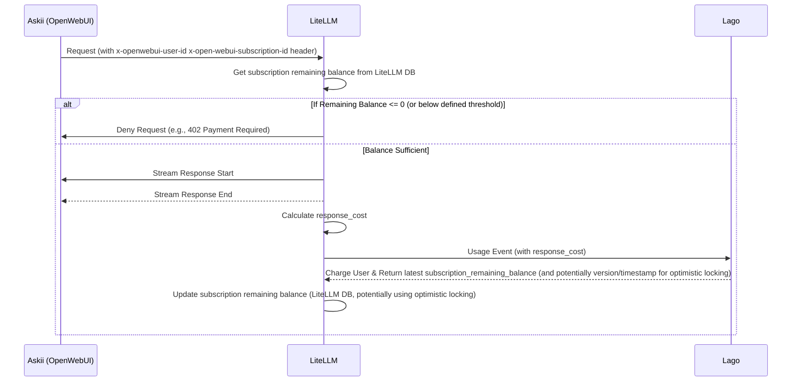

## Billing Process
> Author: [Tran Thien](thientran@coderpush.com).  
> Status: `Proposed`.  
> Target Review due date: May 8, 2024.    
> Target Approval date: May 8, 2024.  
> Reviewers: abc.  
> Approver: Dale Le 

# Problem Statement & Epic Overview
Askii.ai is an AI project focused on providing on-demand AI services. We’ve identified several key challenges:

- **Metric-base subscription**: The cost of each Askii.ai query varies but is very small (approximately $0.0001–$0.003). If we bill each query as an incremental subscription charge, we must create and send many tiny transactions through the Moneta network. Because each amount is so small, Moneta’s network fees (which are a higher percentage for lower transaction amounts) become prohibitive. Processing a high volume of micro-transactions also floods the MO/Publisher and increases operational costs for all participants (network, storage, computation).

- **Entitlement**: Askii.ai streams query results in multiple chunks, each incurring its own token/response cost. We don’t know the total cost until the stream finishes, which complicates real-time entitlement checks.  
   - If we wait until the end of streaming to confirm entitlement, the user experience suffers from latency.  
   - If we pre-authorize before knowing the full cost, we risk under-charging (if the user’s balance is insufficient) or failed subscription charges.

- **Budget Tracking**: Displaying the user’s remaining budget in real time requires aggregating all billable metrics for their plan—a computationally expensive operation. Moreover, this check must run frequently across many views/pages to provide up-to-the-second accuracy.

- **Multi-subscription support (Future)**: During usage surges, users may want to switch between subscription plans. Today, Lago+’s entitlement API (based on AWS AVP) automatically selects the best match, rather than giving users manual control.

- **Free Trial**:  
   - **Challenge:** How do we implement and manage free-trial access?  
   - **Considerations:**  
     - Should the free trial be modeled as a separate plan in Lago?  
     - How will trial usage be tracked and limited?  
     - What is the user experience when transitioning from a free trial to a paid plan?  
     - How does entitlement work for trial users (e.g., full feature access vs. a limited set)?


# High-level architecture diagram

1. **Askii (OpenWebUI)**: The frontend application that sends LLM API requests to LiteLLM
2. **LiteLLM**: The middleware that processes LLM requests, performs entitlement checks and send usage event to Lago.
3. **Lago**: The billing system that tracks usage and manages payments




# Key design decision & consideration

## Follow Async approach
Given the real-time nature of an AI chat service, it is essential to enable users to receive responses immediately. By adopting an asynchronous approach, the system allows users to view results before the billing process begins. While this introduces a minor risk of revenue loss if billing fails post-usage, this risk is acceptable due to the typically low transaction amounts. User experience is prioritized, and mechanisms will be implemented to minimize potential losses.
<!-- 
**Consideration 1: Balance threshold** We can put a threshold (like 0.001$) that check if user remaining balance is above the threshold. When user remaining balance under threshold, (like 0.0005), we will not allow them to use the service.

Pros: 
- We can reduce the loss because we can guarantee user usually have enough balance to perform the next query.

Cons:
- **Complicated Interaction with Lago's Billing Logic**: By default, Lago may not trigger a charge (and subsequent processes like auto-renewal) if the aggregated billable metric usage, reported via events, does not surpass a defined limit or package amount. If LiteLLM's local threshold check strictly prevents users from making requests that would push their usage *just over* such a limit, Lago might never see the "triggering" event.
    - **Impact on Auto-Renewal**: This could prevent auto-renewal from occurring as expected, as Lago might not consider the current billing period "closed" or the package "consumed."
    - **Potential Mitigation/Investigation**:
        - Does Lago offer a way to "ping" a subscription or send a zero-amount event to trigger its internal logic if needed?
        - Can LiteLLM periodically send aggregated usage to Lago, even if it's below the user-facing threshold, to ensure Lago's state is updated?
        - Explore if Lago's `grace_period` settings for subscriptions can be leveraged.
        - This interaction needs careful testing and potentially consultation with Lago support or documentation.
-->
## Use Lago billable metric as a frontier layer to reduce incremental charges.

> TODO: Need to align with anh Trung concept.

We will define a monetary billable metrics (e.g., `credit_cents`)  to represent the total cost a user incurs under a subscription. After each request is completed in LiteLLM, the system will calculate the query's `response_cost` and emit a usage event to this metric, including the corresponding  `subscription_id`.

**[Plan: Starter (0.5$)](https://thepressingly.atlassian.net/wiki/spaces/AAS/pages/7471120/Askii.ai+MVP+Pricing+Plans)**  
This plan allows users to prepay a fixed amount for usage, from which their consumption is deducted.

Expiration: None - valid until fully consumed
Key Features:
- User pays upfront upon first query
- No time limit - budget remains valid until fully used
- Real-time "remaining balance" display
- Auto-renewal option available but not default on
- Ideal for occasional users who want full control

Setup: (proposal)
- Plan Interval: UndefinedPeriod
- BillingFinalizationUpfront: True
- Metric Charges
  - `credit_cents`
    - Charge Model: Package
    - Pay in Advance 
    - Amount: $0.50 Per 50 Credits (e.g., 50 units of `credit_cents` if 1 unit = 1 cent)

**Billable Metric Example**
- Name: `credit_cents`
- Aggregation Type: `sum`
- Property to aggregate: `credit_cents` (e.g., value could be `0.5` for half a cent)

```bash
# Example event: reporting a cost of $0.0023 (0.23 cents)
curl --location --request POST "https://gpt-portal-lagoapi.sandbox.pressingly.net/api/v1/events" \
  --header "Authorization: Bearer __YOUR_API_KEY__" \
  --header 'Content-Type: application/json' \
  --data-raw '{
    "event": {
      "transaction_id": "__UNIQUE_ID__", // e.g., LiteLLM request ID
      "external_subscription_id": "__EXTERNAL_SUBSCRIPTION_ID__", // The subscription ID from OpenWebUI/our system
      "code": "credit_cents", // The billable metric code in Lago
      "timestamp": "__UNIX_TIMESTAMP__", // Optional: recommended for event ordering
      "properties": {
          "credit_cents": 0.23, // The cost in cents
      }
    }
}'
```

## Askii needs to send the selected subscription_id to LiteLLM.
As part of subscription management, Askii will display a list of all active user subscriptions in the UI and allow the user to select which subscription should be used.

**Chat Queries**  
When a user submits a chat query, Askii must include the selected subscription_id in the request header sent to LiteLLM. This will be passed via a custom HTTP header:

```
X-OpenWebUI-Subscription-Id: <subscription_id>
```

**Background/API Calls (Pipe/Filter/Action Functions)**  
For non-interactive processes (e.g., Pipe/Filter/Action functions or other internal API calls), we also need to pass the correct subscription_id. However, this presents a challenge: it can be difficult to retrieve and propagate the current_subscription_id through deeply nested function calls without modifying many interfaces.

**Proposed Solution**  
To address this, whenever a user switches their active subscription, the system will persist the selection by updating:

```
user.settings.default_subscription_id
```

This allows background processes and internal functions to retrieve the current subscription directly from the user’s settings, eliminating the need to pass subscription_id through multiple layers of function calls.

**Request Header Injection**

In `backend/open_webui/routes/openai.py`, the `current_subscription_id` will be automatically added to all outgoing OpenAI/OpenAI-compatible requests using the following HTTP header:
```
X-OpenWebUI-Subscription-Id
```
This ensures consistent propagation of subscription context across both interactive and background use cases.


## Using Subscription Remaining Balance as an Entitlement Check (Instead of the Entitlement API)

The **Lago+ extension** provides an entitlement API that allows us to determine whether a user is authorized to access a resource. This API is designed to accept a usage event in the request body, enabling Lago to update relevant billable metrics. Initially, this endpoint was implemented as a synchronous API to simplify integration for publishers.

However, with our transition to an asynchronous architecture, we can no longer rely on this model. Since usage event submission is now an async step, the entitlement API can no longer block access to a resource in real time—it becomes ineffective as a gatekeeper.

**Optimized Approach for Async Flow**  
To better support the asynchronous model, we will replace the entitlement API with a **subscription remaining balance check**. This check evaluates whether a user’s subscription has sufficient balance remaining before proceeding with a request. Key points:

- The remaining balance is cached in the LiteLLM database.
- This check is lightweight and highly performant.
- It aligns well with an async workflow, allowing for quick eligibility checks without waiting for remote API calls.
- The approach supports real-time entitlement enforcement, even when usage events are reported after the fact.

This method provides a practical and cache-friendly way to validate access in asynchronous systems while maintaining a positive user experience.

## Caching Subscription Remaining Balance in the LiteLLM Database

In asynchronous processes (e.g., `CustomLogger.async_log_success_event`), after submitting a usage event, LiteLLM receives the updated `subscription_remaining_balance` from Lago. This balance will be cached in the LiteLLM database to support fast entitlement checks for subsequent queries.

**Challenge: Stale Cache and Concurrent Updates**  
When multiple queries are processed concurrently for the same subscription, the cached balance may become outdated or inconsistent. An older balance update could overwrite a more recent one if updates are not performed with proper concurrency control.

**Solution: Optimistic Locking**  
To address this, we will apply optimistic locking to ensure that balance updates are applied only if the data has not changed since it was last read. This prevents race conditions and ensures cache consistency.

**Table design: `lago_subscriptions`**

|             Field             |    Type   |                                                                        Description                                                                       |   |   |
|:-----------------------------:|:---------:|:--------------------------------------------------------------------------------------------------------------------------------------------------------:|---|---|
| id                            | uuid      | Primary key. Internal identifier in the LiteLLM database.                                                                                                |   |   |
| subscription_id               | string    | Required. Unique subscription ID from Lago (external_subscription_id). This should correspond to the ID known by OpenWebUI and used in Lago's event API. |   |   |
| customer_id                   | string    | Required. Lago’s external customer ID, which should map to the user ID in OpenWebUI.                                                                     |   |   |
| plan_code                     | string    | Optional. Lago plan code (e.g., starter_plan_v1). Provides context about the subscription.                                                               |   |   |
| status                        | string    | Subscription status, either active (default) or suspended. Calculated by LiteLLM based on remaining_balances and predefined balance_threshold.           |   |   |
| remaining_balances            | jsonb     | The latest known remaining balances for all metrics, as reported by Lago.   Example: { "credit_cents": 123.50, "data_transfer_gb": 5.5 }                 |   |   |
| remaining_balance_snapshot_at | timestamp | Used as the optimistic locking key to validate data freshness during updates.                                                                            |   |   |
| created_at                    | timestamp | Record creation timestamp.                                                                                                                               |   |   |
| updated_at                    | timestamp | Last update timestamp.                                                    


This approach ensures real-time entitlement checks are both performant and reliable in a distributed, asynchronous system.

# Non-functional requirements

- **Performance:**
    - Entitlement check latency (LiteLLM DB query): < 20ms (P95).
    - Async usage event submission to Lago: Should not block the user response path. Completion time < 500ms (P95).
- **Reliability & Durability:**
    - Usage Events: Guaranteed delivery to Lago. Implement a robust retry mechanism with exponential backoff and dead-letter queue for events that fail repeatedly.
    - LiteLLM DB: High availability and data durability for cached balances.
- **Accuracy & Consistency:**
    - Billing Accuracy: `response_cost` calculation must be precise. `credit_cents` (or chosen unit) conversion must be accurate.
- **Scalability:**
    - System should handle X concurrent users and Y requests per second (Define X and Y based on expected load).
    - Lago event ingestion: Ensure it can handle the peak volume of usage events.
    - Lago DB engine should be `ClickDB` instead of `PostgreSQL` for faster data aggregation.
- **Stop Loss:**
    ...
- **Security:**
    - Prevent users to abuse trial plans by re-subscribing.

# APIs and integrations

## Askii (OpenWebUI)
On the Askii (OpenWebUI) side, we will implement subscription management functionality and enhance the integration with LiteLLM to include additional metadata in each request.

### Subscription Management & Selection
- **Displaying Available Subscriptions**:
    - The Askii UI will display a list of all active subscriptions associated with the current user.
    - **Data Source**: This list will be fetched from Lago, but not directly from the client. Instead, the Askii frontend will request the subscription list from the Askii backend, which will handle the query to Lago. This indirection:
      - Prevents exposure of Lago API credentials to the client.
      - Avoids client-side CORS issues.
- **Setting the Active Subscription:**
    - When a user selects a subscription from the displayed list in the Askii UI, or if a subscription is chosen by any other means (e.g., initial subscription activation), the Askii backend will update the `user.settings.default_subscription_id` field for that user to this chosen subscription's ID.
    - `user.settings.default_subscription_id` becomes the **single source of truth** for the currently active/selected subscription for all operations, including interactive chat and background processes.

### Sending Subscription ID to LiteLLM
- **Unified Approach**: For all requests to LiteLLM (interactive chat, background processes, etc.) that require a subscription context:
    - The component making the request (e.g., Askii backend for chat, or a background service) will first retrieve the `user.settings.default_subscription_id` for the relevant user.
    - This retrieved `default_subscription_id` will then be passed to LiteLLM via the `X-OpenWebUI-Subscription-Id` HTTP header.
    - This ensures LiteLLM consistently uses the subscription that the user has designated as their current default.
- **Example**: In `backend/open_webui/routes/openai.py`, before forwarding a request to LiteLLM, the Askii backend will:
    1. Identify the user (e.g., via `x-openwebui-user-id`).
    2. Fetch `user.settings.default_subscription_id` for this user.
    3. Add this ID as the `X-OpenWebUI-Subscription-Id` header.

## LiteLLM
LiteLLM will use its `CustomLogger`—specifically `async_log_success_event`—to handle the following responsibilities in the asynchronous usage flow:

**Initial Entitlement Check**  
Use the cached subscription balance from the LiteLLM database to verify the user has sufficient credit to proceed.

**Post-Response Billing Workflow**   
1. Calculate `response_cost`.  
2. Construct and send usage event to Lago.  
3. Receive updated balance information from Lago.  
4. Update the cached `lago_subscriptions` record in LiteLLM DB (using optimistic locking). 

# Test Strategy outline

- **Unit Tests:**
    - `response_cost` calculation logic in LiteLLM.
    - Entitlement check logic in LiteLLM (based on cached balance and thresholds).
    - Lago event formatting.
    - Optimistic locking conflict resolution logic in LiteLLM.
- **Integration Tests:**
    - Full flow: Askii (mocked) -> LiteLLM -> Lago (mocked/sandbox).
        - Test successful request, usage event, balance update.
        - Test request denial due to insufficient balance.
    - LiteLLM <-> LiteLLM DB: Correct caching and retrieval of balance.
    - LiteLLM <-> Lago API:
        - Event submission and response handling (success, failures, retries).
        - Handling of various Lago API responses (e.g., errors, different balance structures).
- **End-to-End Tests (with actual Lago sandbox):**
    - User signs up, gets a subscription.
    - User makes requests, usage is tracked, balance is updated.
    - Test threshold logic: user balance drops below threshold, access is denied/restricted.
    - Test auto-renewal (if applicable to plan and threshold logic correctly interacts).
    - Test plan changes/upgrades/cancellations if part of MVP.
- **Performance Tests:**
    - Load testing on LiteLLM entitlement check endpoint.
    - Measuring latency of the async event submission process.
- **Failure Scenario Testing:**
    - Lago API unavailable: Test retry mechanisms.
    - LiteLLM DB unavailable: Test fallback behavior (e.g., deny access if cache is critical).
    - Invalid data from Lago.
    - Race conditions for balance updates (if optimistic locking is not perfectly implemented).
- **Billing Accuracy Tests:**
    - Generate known amounts of usage, verify that the `credit_cents` (or other units) sent to Lago are correct.
    - Reconcile Lago invoices/reports with internal usage logs.
- **Security Tests:**
    - Ensure API keys are not exposed.
    - Test for any vulnerabilities in how subscription data is handled.

# Open Questions & Risks

- **Risks:**
    - **Data Inconsistency**: Cached balance in LiteLLM DB might become stale or inconsistent with Lago's actual balance, leading to incorrect entitlement decisions. Requires robust update and reconciliation.
    - **Revenue Loss**:
        - Failures in async event submission to Lago.
        - Bugs in `response_cost` calculation.
        - Users consuming resources when their true balance (in Lago) is depleted but LiteLLM cache is stale.
    - **Race Conditions**: Concurrent updates to the same subscription balance in LiteLLM DB if optimistic locking is not effective.
    - **Complexity**: The interaction between LiteLLM's local threshold and Lago's billing logic for things like package consumption and auto-renewal could be complex to implement correctly.
    - **Scalability of Event Submission**: If many users generate many small events, the async processing queue in LiteLLM needs to be scalable.

# Additional Section

