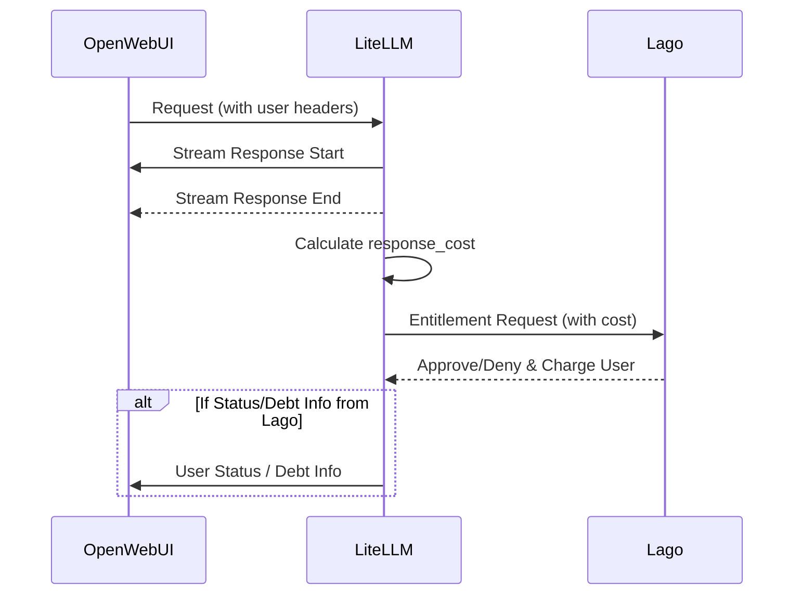
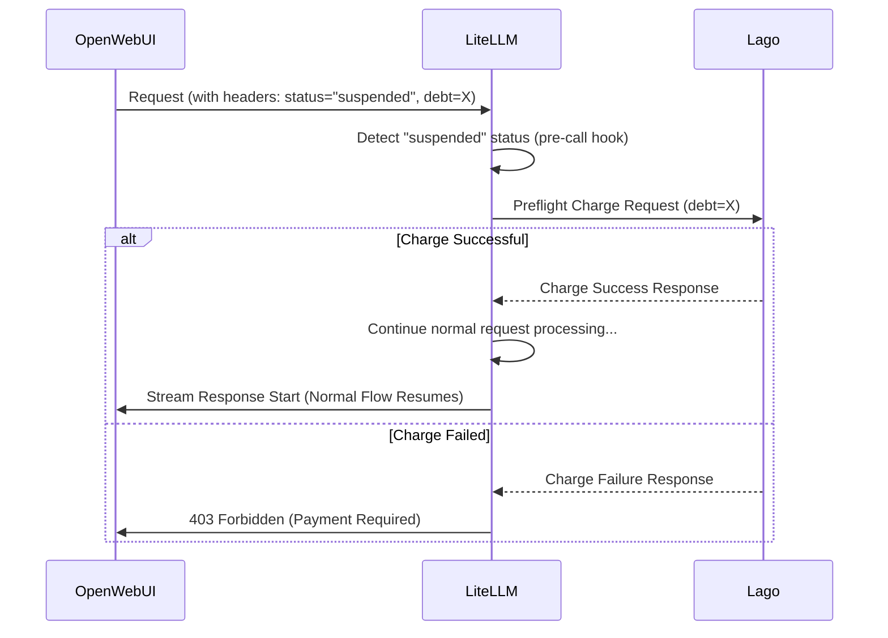
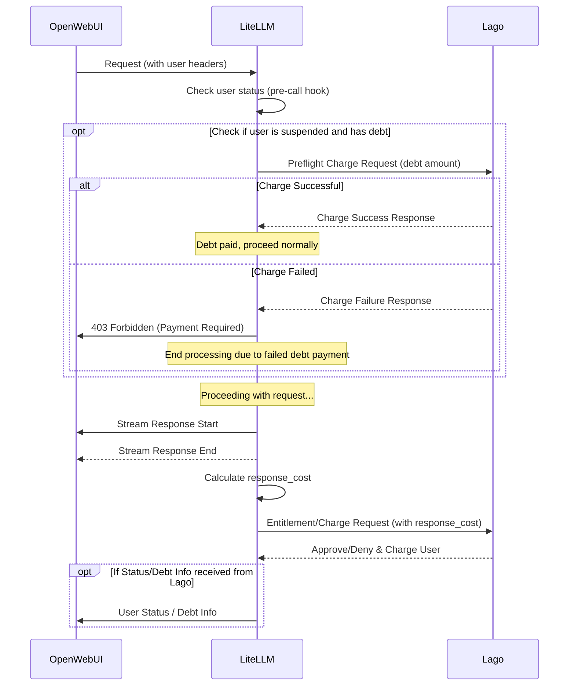

# Technical Design: Lago Integration with LiteLLM for OpenWebUI

## Overview

This document outlines the technical design for integrating Lago with LiteLLM to provide LLM API services for OpenWebUI, with a focus on entitlement checks and debt payment handling.

## System Components

1. **OpenWebUI**: The frontend application that sends LLM API requests to LiteLLM
2. **LiteLLM**: The middleware that processes LLM requests and performs entitlement checks
3. **Lago**: The billing and entitlement service that tracks usage and manages payments

## Flow Diagram

```
┌───────────┐         ┌───────────┐         ┌───────────┐
│           │         │           │         │           │
│ OpenWebUI │ ──────> │  LiteLLM  │ ──────> │   Lago    │
│           │         │           │         │           │
└───────────┘         └───────────┘         └───────────┘
      │                    │                     │
      │                    │                     │
      │                    │                     │
      │                    │                     │
      │ <────────────────────────────────────── │
      │                    │                     │
      │                    │                     │
      ▼                    ▼                     ▼
```

## Request Flow

### Normal Request Flow (User in Good Standing)

1. OpenWebUI sends a request to LiteLLM with user information in headers
  - `x-openwebui-user-id`: User identifier
  - `x-openwebui-user-status`: Set to "suspended"
  - `x-openwebui-user-debt`: Amount of debt to be paid
  - `x-openwebui-user-debt-req-id`: idempotent key of the debt charge id.
2. LiteLLM processes the request and streams the response back to OpenWebUI
3. After the stream completes, LiteLLM calculates the final `response_cost` in `async_log_success_event`
4. LiteLLM makes an entitlement request to Lago with the cost information
5. Lago approves/denies the request and charges the user's account
6. LiteLLM responses to the OpenWebUI with the user-status / user-debt if any



### Suspended User Flow
The flow is happen when a user is temporary suspended because we can not charge their request. This flow is rarely happen because most of the time, the normal request flow will be triggered (expect ratio is **less than 1%**).

1. OpenWebUI sends a request to LiteLLM with headers including:
  - `x-openwebui-user-id`: User identifier
  - `x-openwebui-user-status` (optional, default is `ok`): Set to "suspended"
  - `x-openwebui-user-debt` (optional): Amount of debt to be paid
  - `x-openwebui-user-debt-req-id` (optional): idempotent key of the debt charge id.
2. LiteLLM detects the "suspended" status in the pre-call hook
3. LiteLLM makes a preflight request to Lago to charge the debt amount (`x-openwebui-user-debt`)
4. If the charge is successful, LiteLLM proceeds with the normal request flow
5. If the charge fails, LiteLLM returns a 403 Forbidden response


## Implementation Details

The full flow



### 1. EntitlementCallback Class

The `EntitlementCallback` class in LiteLLM will be enhanced to:

```python
class EntitlementCallback(CustomLogger):
    def __init__(self):
        self.publisher_id = os.environ.get("PUBLISHER_ID", "GPTPortalHub")
        self.api_base = os.environ.get("ENTITLEMENT_API_BASE", "").rstrip("/")
        self.auth_url = f"{self.api_base}/v1/entitlement/authorize"
        self.charge_url = f"{self.api_base}/v1/entitlement/charge"
        self.default_action = os.environ.get("ENTITLEMENT_ACTION", "read")
        super().__init__()

    async def async_pre_call_hook(
        self,
        user_api_key_dict: UserAPIKeyAuth,
        cache: DualCache,
        data: dict,
        call_type: str,
    ):
        """
        Check if user is suspended and handle debt payment if needed
        """
        # Extract headers from request data
        headers = data.get("metadata", {}).get("headers", {})
        user_id = headers.get("x-openwebui-user-id")
        user_status = headers.get("x-openwebui-user-status")
        user_debt = headers.get("x-openwebui-user-debt")

        if not user_id:
            return data

        # If user is suspended, attempt to charge the debt
        if user_status == "suspended" and user_debt:
            try:
                debt_amount = float(user_debt)
                # Make preflight request to charge debt
                charge_success = await self.charge_debt(user_id, debt_amount)

                if not charge_success:
                    # If charge fails, deny the request
                    raise HTTPException(
                        status_code=403,
                        detail={"error": "Please settle your outstanding balance before continuing"}
                    )
            except Exception as e:
                raise HTTPException(
                    status_code=403,
                    detail={"error": f"Error processing payment: {str(e)}"}
                )

        return data

    async def charge_debt(self, external_customer_id, amount):
        """
        Make a request to Lago to charge the user's debt
        """
        payload = {
            "external_customer_id": external_customer_id,
            "publisher_id": self.publisher_id,
            "amount_in_cents": amount * 100,  # Convert to cents
            "timestamp": int(time.time())
        }

        try:
            async with httpx.AsyncClient(timeout=5.0) as client:
                headers = {"Authorization": f"Bearer {os.environ.get('MONETA_LAGO_API_KEY')}"}
                response = await client.post(self.charge_url, json=payload, headers=headers)

                if response.status_code != 200:
                    return False

                result = response.json()
                return result.get("status") == "success"
        except Exception as e:
            print(f"Debt charge error: {e}")
            return False

    async def handle_entitlement_check(self, external_customer_id, response_cost):
        """
        Check if the user is entitled to make this request
        """
        if not external_customer_id:
            return "Missing required customer ID for entitlement check."

        entitlement_resource = {
            "id": 1,
            "name": "",
            "type": "article",
            "author": "any.email@is.fine",
            "tags": [],
            "amount": response_cost * 100
        }

        payload = {
            "external_customer_id": external_customer_id,
            "publisher_id": self.publisher_id,
            "action_name": self.default_action,
            "context": [],
            "resource": entitlement_resource,
            "properties": {
                "credits_in_cent": response_cost * 100
            },
            "timestamp": int(time.time())
        }

        try:
            async with httpx.AsyncClient(timeout=5.0) as client:
                headers = {"Authorization": f"Bearer {os.environ.get('MONETA_LAGO_API_KEY')}"}
                response = await client.post(self.auth_url, json=payload, headers=headers)
        except Exception as e:
            return f"Entitlement check error: {e}"

        if response.status_code != 200:
            raise HTTPException(status_code=403, detail={"error": "Access denied by entitlement"})

        result = response.json()
        allowed = bool(result.get("status") == "Allow")
        if not allowed:
            raise HTTPException(status_code=403, detail={"error": "Access denied by entitlement"})

    async def async_log_success_event(self, kwargs, response_obj, start_time, end_time):
        """
        Log the successful completion of a request and charge the user
        """
        # Extract user ID from request metadata
        metadata = kwargs.get("metadata", {})
        headers = metadata.get("headers", {})
        user_id = headers.get("x-openwebui-user-id")

        # Calculate response cost
        response_cost = response_obj.get("response_cost", 0)
        print(f"Response cost for user {user_id}: {response_cost}")

        if user_id and response_cost > 0:
            # Make entitlement request to Lago
            await self.handle_entitlement_check(user_id, response_cost)
```

### 2. OpenWebUI Integration

OpenWebUI will need to:

1. Track user status (normal or suspended)
2. Include the appropriate headers in requests to LiteLLM:
   - `x-openwebui-user-id`: Always included
   - `x-openwebui-user-status`: Set to "suspended" if applicable
   - `x-openwebui-user-debt`: Included only if user is suspended

3. Handle 403 responses from LiteLLM by:
   - Displaying appropriate error messages to the user
   - Providing payment options if the error is related to entitlement

### 3. Lago API Endpoints

Lago will need to provide two key endpoints:

1. **Entitlement Check Endpoint** (`/v1/entitlement/authorize`):
   - Verifies if a user has sufficient credits for a request
   - Charges the user's account for the request
   - Returns "Allow" or "Deny" status

2. **Debt Payment Endpoint** (`/v1/entitlement/charge`):
   - Processes payments for users with outstanding debt
   - Returns success or failure status

## Error Handling

1. **Network Errors**: If Lago is unreachable, LiteLLM should log the error and allow the request to proceed (fail open) to prevent service disruption.

2. **Entitlement Errors**: If a user lacks sufficient credits, LiteLLM will return a 403 response with a clear error message.

3. **Debt Payment Errors**: If a debt payment fails, LiteLLM will return a 403 response with details about the payment failure.

## Preventing Double Charging

To prevent charging users twice for the same request:

1. Lago should implement idempotency keys for payment transactions (check [Lago Event Transaction ID](https://docs.getlago.com/api-reference/events/usage#body-event-transaction-id))
2. Each charge request should include a unique transaction ID
3. For suspended users, the debt payment and the new request should be treated as separate transactions with different IDs

## Monitoring and Logging

1. All entitlement checks and debt payments should be logged with:
   - User ID
   - Request ID
   - Response cost
   - Transaction status

2. Implement monitoring for:
   - Failed entitlement checks
   - Failed debt payments
   - Response time of Lago API calls

## Security Considerations

1. All communication between LiteLLM and Lago should be encrypted (HTTPS)
2. API keys should be stored securely as environment variables
3. User IDs should be validated to prevent injection attacks

## Future Enhancements

1. **Quota Management**: Implement user quotas to limit usage before incurring charges
2. **Prepaid Credits**: Allow users to purchase credits in advance
3. **Usage Analytics**: Provide detailed usage reports to users
4. **Graduated Pricing**: Implement tiered pricing based on usage volume

## Conclusion

This integration enables a seamless billing experience for OpenWebUI users while ensuring proper entitlement checks and debt management. The design prioritizes reliability, security, and user experience while preventing issues like double charging.
