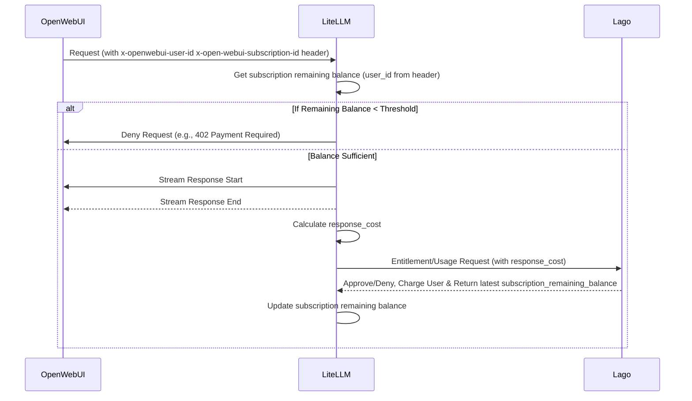

# Technical Design: Lago Integration with LiteLLM for OpenWebUI

## Overview

This document outlines the technical design for integrating Lago with LiteLLM to provide LLM API services for OpenWebUI, with a focus on entitlement checks and debt payment handling.

The main idea is perform the query first and post-check entitlement. Use LiteLLM user status to determine if the user is able to use service.

LiteLLM will have new database tables to store user status which is synced from Lago.
LiteLLM will check the status before performing query
In checking status. We consider between 2 things:
- debt: we don't limit user from using the service. when user fail to pay for the service, we record a debt number. This number is used to charge in the next time. (need to handle debt and race condition)
- balance threshold: If current balance of user is lower than a threshold, we stop user from using services. (need to get balance threshold more often. need to work with Lago team to make sure the cost of query is cheap)


Todo:
- Need to store external_user_id on litellm
- Need to get current remaining budget of a subscription
- Need to know what is the selected subscription


Once the subscription is locked, 


## System Components

1. **OpenWebUI**: The frontend application that sends LLM API requests to LiteLLM
2. **LiteLLM**: The middleware that processes LLM requests and performs entitlement checks
3. **Lago**: The billing and entitlement service that tracks usage and manages payments

## Request Flow

1. OpenWebUI sends a request to LiteLLM with user information in headers
  - `x-openwebui-user-id`: User identifier
  - `x-openwebui-subscription-id`: current subscription
2. LiteLLM will get `subscription.remaining_balance` in LiteLLM Database to find out if the user is active and has sufficient balance.
  - If `subscription.remaining_balance` is below a predefined threshold, LiteLLM denies the request (e.g., returns a 402 Payment Required or similar error to OpenWebUI).
3. If the user is active and balance is sufficient, LiteLLM processes the request and streams the response back to OpenWebUI
4. After the stream completes, LiteLLM calculates the final `response_cost` in `async_log_success_event`
5. LiteLLM send usage event (`?sync=true&with_remaining_budget=true` in the payload)/ entitlement req to Lago with the cost information. The entitlement query also send the usage event.
6. Lago approves/denies the request and charges the user's account and return the latest state of `subscription_remaining_balance`
7. LiteLLM update subscription remaining balance.




## Implementation Details

### Database

`lago_subscriptions`
- id: `uuidv4` - required: id of lago subscription (source from lago/openwebui)
- customer_id: `uuidv4` - optional: lago external customer id aka openwebui user id
- plan_id: `uuidv4` - optional: the plan_id of subscription_id
- status - `string` - `active` (default) or `suspended`: This status will be calculated from remaining balance & threshold
- balance_threshold: `jsonb` - based on plan_id, we will extract the balance threshold (for example 10% of quantitative metrics)
    - example data: { credit: 10, remaining_query_count: 1 }
- remaining_balance: `jsonb`: current remaining balance of a subscription
    - example data: { credit: 10, remaining_query_count: 1, expired_at: 1746778147 }

### CustomLogger
We will use LiteLLM CustomLogger to create a new logger to implement the strategy.

Refs:
- https://docs.litellm.ai/docs/proxy/logging#custom-callback-class-async
- https://docs.litellm.ai/docs/observability/lago
- @custom_logger.py (litellm.integrations.custom_logger)

Create new logger `BillingLogger`.
Add new `BillingLogger` to the config file.

- `pre_call_check` - sync: We will use this hook for entitlement check
- `async_log_success_event` - async : after gathering query cost, we will use this hook to perform entitlement query to lago to submit usage event
  - During streaming, async_log_stream_event is called for each chunk, but it doesn't have cost information since the complete response isn't available yet. It will be called one final time after the stream completes (with the complete cost info). Therefore, we need to check if the response cost is exist before sending out the usage event.


Detail implementation

1. Entitlement Check
in `pre_call_check`, get the subscription_id from request headers (`x-openwebui-subscription-id`).
Query database to get subscription data.
- If subscription data is not exist
Check if the status is `active` or `suspended` to decide continue the request or return an error message and a proper http code

2. Submit usage event:
Gather response cost & subscription id. generate new lago event and submit it to lago

When we send usage event to Lago, we can get the latest subscription remaining balance from Lago. For example:

```
curl --location --request POST "$LAGO_URL/api/v1/events?sync=true&with_remaining_budget=true" \
--header "Authorization: Bearer $API_KEY" \
--header 'Content-Type: application/json' \
--data-raw '{
      "event": {
          "transaction_id": "__UNIQUE_ID__",
          "external_subscription_id": "__YOUR_SUBSCRIPTION_ID__",
          "code": "__BILLABLE_METRIC_CODE__",
          "timestamp": $(date +%s),
          "properties": {
            "credit_cents": 0.012
          }
      }
  }'
```

The response will be:

```
{
  "subscription_remaining_balance": [
    {
      "billable_metric_id": "__BILLABLE_METRIC_ID__",
      "total_usage": 100,
      "total_deposited_credits": 1000,
      "remaining_balance": 900
    }
  ]
}
```

update the subscription with the remaining balance in the response
Compare the subscription.remaining_data with threshold. Compare remaining balance with the threshold.
- If it is aboves threshold: update status = active
- If it is below threshold: update status = suspended
