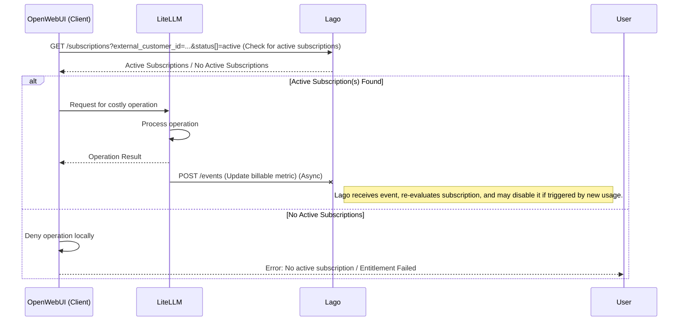
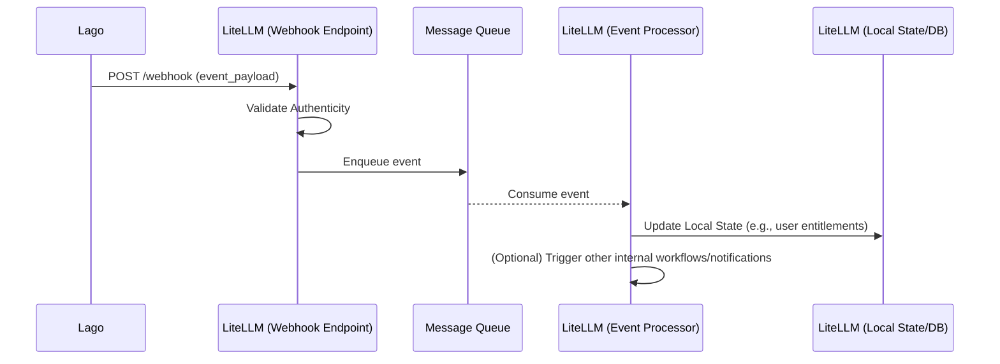

    # General idea
    Check lago active subscription (fast)
    - Possible because this is a fast request
    Delegate for LiteLLM to handle all Lago Event?!

    # Pros
    Straight forward

    # Cons
    Make an extra request before processing (but it's fast for checking active subscription)
    Async => maybe suffer more lost.
    Lose money but it's fine because only a small amount of money

    # Concerns
    - Combine with multiple subscriptions
    - Need to check if a charge fail, the active subscription is suspended
    - Need to check if user abuses system by switching packages
    - Need to check if conflict with user subscribe new package but no use = active subscriptions.

    - Does get active subscription is a valid "entitlement" method?! (need to check with @tron)

## Proposed Design Elaboration

This section expands on the initial ideas, aiming to create a more robust and detailed design for cost tracking and entitlement management using Lago and LiteLLM.

### 1. Refined Architecture

The core idea is to use Lago as the source of truth for subscription status and billing, with LiteLLM acting as the entitlement enforcer and event processor.

*   **Primary Entitlement Check (Real-time by Client):**
    *   Before initiating a potentially costly operation, the Client application (e.g., OpenWebUI) will make a direct, synchronous API call to Lago (e.g., `GET /api/v1/subscriptions?external_customer_id={user_id}&status[]=active`) to check for an active subscription for the user.
    *   This ensures the most up-to-date entitlement status from Lago is used for gating access before the request reaches LiteLLM.
    *   If no active subscription is found, the Client can prevent the operation from proceeding.

*   **Event-Driven Updates & Local State (Optional but Recommended for efficiency/audit):**
    *   LiteLLM will subscribe to relevant webhook events from Lago (e.g., `subscription.created`, `subscription.updated`, `subscription.terminated`, `invoice.paid`, `invoice.payment_failed`).
    *   These events can be used to update a local, denormalized cache or database within LiteLLM. This local state can serve:
        *   As a faster, secondary check for non-critical operations (though primary checks for cost-incurring actions should still hit Lago directly).
        *   For internal analytics, auditing, and faster lookups of user status history.
        *   To trigger other workflows within LiteLLM (e.g., sending notifications).
    *   A robust queuing system (e.g., RabbitMQ, Kafka) should be used for ingesting and processing these events asynchronously.

### 2. Addressing Concerns

*   **Concern: Combine with multiple subscriptions**
    *   **Solution:** The Lago API response for an "active subscription" check should ideally list all active subscriptions or provide a clear way to determine the highest-level or relevant subscription. LiteLLM's logic will need to be designed to interpret this information according to defined business rules (e.g., aggregating entitlements, prioritizing certain plans).

*   **Concern: Need to check if a charge fail, the active subscription is suspended**
    *   **Solution:** This is critical.
        1.  Lago must clearly signal subscription suspension/termination via specific webhook events (e.g., `subscription.updated` with a status like `suspended`, or `subscription.terminated`).
        2.  LiteLLM must process these events promptly to update its local state (if used) and deny access.
        3.  The direct "active subscription" check to Lago should always reflect the true current status, including any suspensions due to payment failures.

*   **Concern: Need to check if user abuses system by switching packages**
    *   **Solution:**
        *   **Proration:** Rely on Lago to handle proration correctly during package switches.
        *   **Immediate Entitlement Update:** The direct "active subscription" check should always reflect the entitlements of the *current* package.
        *   **Event Auditing:** LiteLLM should log all `subscription.updated` events (including package changes) for monitoring and potential abuse detection.
        *   **Cooldown (Business Decision):** Consider if a cooldown period for frequent package switching is necessary and feasible to implement.

*   **Concern: Need to check if conflict with user subscribe new package but no use = active subscriptions.**
    *   **Solution:** If Lago deems a subscription "active" upon creation (even before payment, e.g., for trials or freemium leading to paid), then LiteLLM will grant entitlement based on this. This is standard. The concern is more about financial reconciliation (ensuring payment follows activation) which is Lago's primary responsibility. LiteLLM's role is to honor the "active" status reported by Lago.

*   **Concern: Does get active subscription is a valid "entitlement" method?! (need to check with @tron)**
    *   **Action Item:** This remains a key point to clarify with @tron and through Lago API documentation. The query to Lago must reliably indicate if a user is *currently entitled* to use the service, considering all possible states (active, grace period, suspended, trialing, etc.).

### 3. Detailed Flow for Lago Event Handling by LiteLLM

1.  **Webhook Configuration:** Set up Lago to send webhooks for all relevant events to a secure endpoint in LiteLLM.
2.  **Webhook Ingestion & Queuing:**
    *   LiteLLM's endpoint receives webhooks, validates their authenticity (e.g., signature check), and places them onto a durable message queue.
3.  **Asynchronous Event Processors:**
    *   Dedicated worker services consume events from the queue.
    *   Implement idempotent handlers for each event type:
        *   `subscription.created/updated`: Create/update user record in LiteLLM's local store; adjust entitlements; potentially trigger onboarding flows.
        *   `subscription.terminated`: Mark subscription as inactive in local store; revoke entitlements.
        *   `invoice.paid`: Log for records, confirm service continuity.
        *   `invoice.payment_failed`: Log for records; if Lago signals suspension based on this, the corresponding `subscription.updated` event will handle entitlement changes.
4.  **Error Handling & DLQ:** Failed event processing attempts should be retried. Persistent failures should route events to a Dead Letter Queue (DLQ) for investigation.
5.  **Logging & Monitoring:** Comprehensive logging of event reception, processing, and errors.

### 4. Mitigating "Async => maybe suffer more lost"

*   **Primary Reliance on Direct Check:** For critical, cost-incurring operations, the primary entitlement decision comes from the synchronous, real-time check to Lago. This minimizes risk from async processing delays.
*   **Robust Queuing:** Use a persistent, reliable message queue.
*   **Idempotent Consumers & Retries:** Design event handlers to be idempotent and implement retry logic.
*   **Reconciliation Process (Periodic):**
    *   Implement a batch job (e.g., daily) that fetches all "active" subscriptions from Lago and compares them against LiteLLM's local understanding (if a local cache is maintained).
    *   This helps identify and correct discrepancies due to missed webhooks or processing errors.
*   **Alerting:** Set up alerts for high failure rates in event processing or significant discrepancies found during reconciliation.

### 5. Revised Pros & Cons

**Pros:**
*   **Accuracy:** Direct Lago check for critical entitlements ensures high accuracy.
*   **Decoupling:** Clear separation of concerns: Lago for billing truth, LiteLLM for entitlement enforcement.
*   **Scalability:** Asynchronous event processing for local state updates can handle high event volumes.
*   **Resilience:** With queues, retries, and reconciliation, the system can be made robust against transient failures.

**Cons:**
*   **Complexity:** Implementing webhook handling, queuing, and reconciliation adds development and operational overhead to LiteLLM.
*   **Dependency on Lago's API & Webhooks:** Reliability of Lago's services is crucial.
*   **Latency of Direct Check:** The synchronous call to Lago for entitlement will add latency to requests. This is why it's "fast" but still an extra step. The initial "Cons" about the extra request remains valid, but its impact needs to be acceptable.

### 6. Action Items / Next Steps

1.  **Deep Dive with @tron & Lago Documentation:**
    *   Confirm the precise meaning and reliability of Lago's "active subscription" status for real-time entitlement.
    *   Identify all relevant Lago API endpoints and webhook events.
    *   Understand Lago's behavior on payment failures, suspensions, grace periods, etc.
2.  **Define Business Rules:**
    *   How to handle multiple active subscriptions for a single user?
    *   What are the exact criteria for granting/revoking access based on subscription states?
3.  **Technical Design Choices for LiteLLM:**
    *   Finalize if a local entitlement cache is needed. If so, select database/storage.
    *   Select message queue technology (if event processing is adopted).
    *   Design the schema for local user/subscription data (if any).
4.  **Develop & Test:**
    *   Implement Lago API client in LiteLLM.
    *   Develop webhook ingestion endpoint and event processors.
    *   Implement the reconciliation logic.
5.  **Security:** Ensure webhook endpoint is secured (e.g., using signature verification as provided by Lago).
6.  **Monitoring & Alerting Strategy:** Define key metrics to monitor for the health of the integration. 
