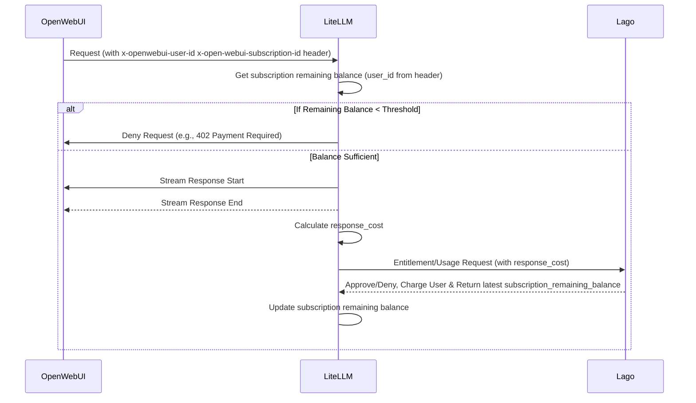

# Technical Design: Lago Integration with LiteLLM for OpenWebUI

## Overview

This document outlines the technical design for integrating Lago with LiteLLM to provide LLM API services for OpenWebUI, with a focus on entitlement checks and debt payment handling.

The main idea is perform the query first and post-check entitlement. Use LiteLLM user status to determine if the user is able to use service.

LiteLLM will have new database tables to store user status which is synced from Lago.
LiteLLM will check the status before performing query
In checking status. We consider between 2 things:
- debt: we don't limit user from using the service. when user fail to pay for the service, we record a debt number. This number is used to charge in the next time. (need to handle debt and race condition)
- balance threshold: If current balance of user is lower than a threshold, we stop user from using services. (need to get balance threshold more often. need to work with Lago team to make sure the cost of query is cheap)

Todo:
- Need to store external_user_id on litellm
- Need to get current remaining budget of a subscription
- Need to know what is the selected subscription

## System Components

1. **OpenWebUI**: The frontend application that sends LLM API requests to LiteLLM
2. **LiteLLM**: The middleware that processes LLM requests and performs entitlement checks
3. **Lago**: The billing and entitlement service that tracks usage and manages payments

## Request Flow

1. OpenWebUI sends a request to LiteLLM with user information in headers
  - `x-openwebui-user-id`: User identifier
2. LiteLLM will get `subscription.remaining_balance` in LiteLLM Database to find out if the user is active and has sufficient balance.
  - If `subscription.remaining_balance` is below a predefined threshold, LiteLLM denies the request (e.g., returns a 402 Payment Required or similar error to OpenWebUI).
3. If the user is active and balance is sufficient, LiteLLM processes the request and streams the response back to OpenWebUI
4. After the stream completes, LiteLLM calculates the final `response_cost` in `async_log_success_event`
5. LiteLLM send usage event (`?sync=true&with_remaining_budget=true` in the payload)/ entitlement req to Lago with the cost information
6. Lago approves/denies the request and charges the user's account and return the latest state of `subscription_remaining_balance`
7. LiteLLM update subscription remaining balance.

## Implementation Details

### Database

`lago_subscriptions`
- id: `uuidv4` - required: id of lago subscription (source from lago/openwebui)
- customer_id: `uuidv4` - optional: lago external customer id aka openwebui user id
- plan_id: `uuidv4` - optional: the plan_id of subscription_id
- balance_threshold: `jsonb` - based on plan_id, we will extract the balance threshold (for example 10% of quantitative metrics)
    - example data: { credit: 10, remaining_query_count: 1 }
- remaining_balance: `jsonb`: current remaining balance of a subscription
    - example data: { credit: 10, remaining_query_count: 1, expired_at: 1746778147 }
